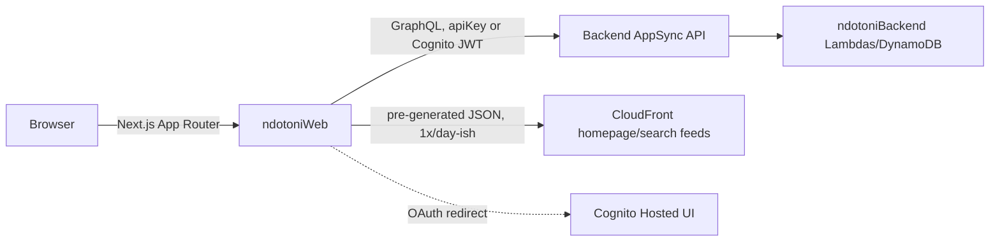

# Ndotoni Web — Documentation Index

Next.js 14 (App Router) frontend for `ndotoni.com` — the long-term rental product, an
internal admin panel, and the landlord/agent dashboard. This doc set is for engineers and
AI agents who need to understand or debug this codebase without re-deriving it from
scratch.

For local setup (install, env vars, dev server, deploy), see the
[root README](../README.md). This index is about how the app works.

**A note on this doc set**: this repo previously had ~30 scattered markdown files (root
+ a `documentation/` folder) describing caching, subscriptions, and various migrations.
Several of them described functionality that either never shipped or was later replaced —
verified by direct comparison with the actual source before this doc set was written (see
[architecture.md § known gaps](./architecture.md#known-gaps--dead-code) for specifics).
Those files have been deleted. If you find a claim in these new docs that no longer
matches the code, trust the code and fix the doc, the same discipline that produced this
rewrite in the first place.

## Documentation map

| Doc | Read it when you need to... |
|---|---|
| [architecture.md](./architecture.md) | Understand the tech stack, the full route map, and known dead code / stale-doc traps. |
| [graphql-and-caching.md](./graphql-and-caching.md) | Add/change a GraphQL call, understand the three caching layers, or regenerate types after a backend schema change. |
| [auth.md](./auth.md) | Work on sign-in/sign-up, route protection, or role-based access (tenant/landlord/agent/admin). |
| [admin-and-host.md](./admin-and-host.md) | Work on the internal admin panel or the landlord/agent host dashboard. |

## The 60-second mental model

1. **This app is bigger than "a listings site."** Beyond public property browsing, it
   contains a full internal admin panel (`/admin/*`, role-gated) and the authenticated
   landlord/agent dashboard (`/host/*`) — see
   [admin-and-host.md](./admin-and-host.md). A generic-sounding route name doesn't always
   mean what it sounds like: `/landlord` is a *public marketing page*, not the dashboard
   (`/host` is); `/stays` is a "my current lease" tenant view, not the short-term-stays
   feature.
2. **"Short-term stays" is both an outbound link and a dark in-app feature.** The homepage
   promotes short stays with an external link to `ndotonistays.com` (the sister app), but
   this repo *also* contains a working in-app short-term search/booking/payment
   implementation, gated behind `NEXT_PUBLIC_ENABLE_SHORT_TERM_STAYS` (default `false`).
   Don't assume "short-term stays lives in the other repo" — check the flag before
   concluding a bug can't be here.
3. **No middleware-based auth.** `middleware.ts` exists but its check is effectively
   dead (reads a cookie that's never set) — real route protection is entirely
   client-side via `AuthGuard`. See [auth.md](./auth.md) for the specifics and why this
   matters if you're debugging an access-control issue.
4. **Three separate caching mechanisms coexist**, and one of them (per-property CloudFront
   JSON fetch) has zero call sites — dead code. See
   [graphql-and-caching.md](./graphql-and-caching.md) before assuming a cache you found
   is the one actually in the request path for a given page.
5. **Same Cognito user pool as `ndotoniStays`** — a user account works on both
   `ndotoni.com` and `ndotonistays.com` without re-registering.
